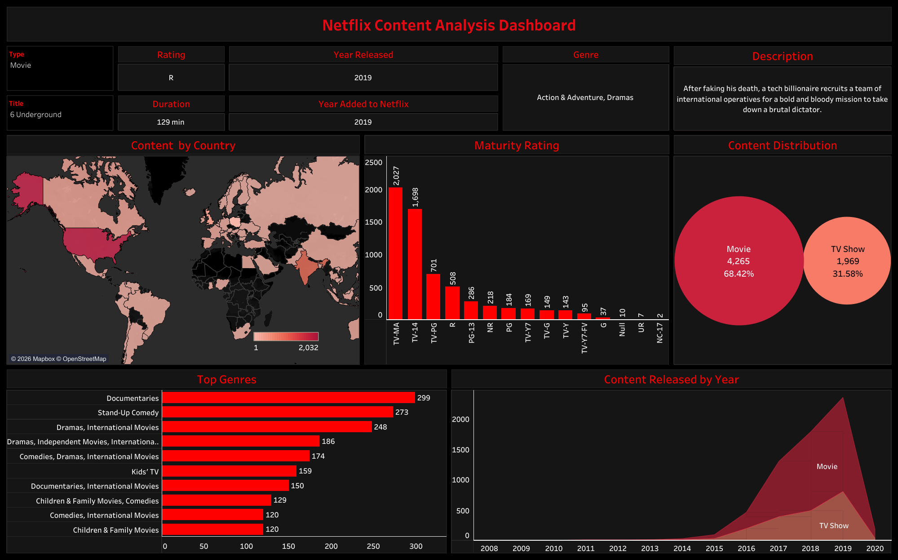

# Netflix Content Analysis Dashboard

## Overview

This project presents an interactive Tableau dashboard that explores Netflix's content library through multiple analytical perspectives. The dashboard provides insights into content distribution, genres, release trends, ratings, countries, and the balance between movies and TV shows.

The objective of this project is to demonstrate how interactive visualizations can be used to explore large datasets, identify patterns, and communicate meaningful insights through dashboard design.

---

## Dashboard Features

- Interactive dashboard filters
- KPI summary cards
- Genre distribution analysis
- Movie vs TV Show comparison
- Country-wise content analysis
- Content ratings analysis
- Release year trends
- Customized tooltips

---

## Tools & Technologies

- Tableau
- Data Visualization
- Dashboard Design
- Business Intelligence

---

## Dashboard Preview

---

## Interactive Dashboard

[View Interactive Dashboard on Tableau Public](https://public.tableau.com/views/NetflixContentAnalysisDashboard_17829665334710/NetflixContentAnalysisDashboard?:language=en-US&:sid=&:redirect=auth&:display_count=n&:origin=viz_share_link)

---

## Repository Contents

- Tableau Workbook (.twbx)
- Dashboard Preview Image
- Project Documentation (README)

